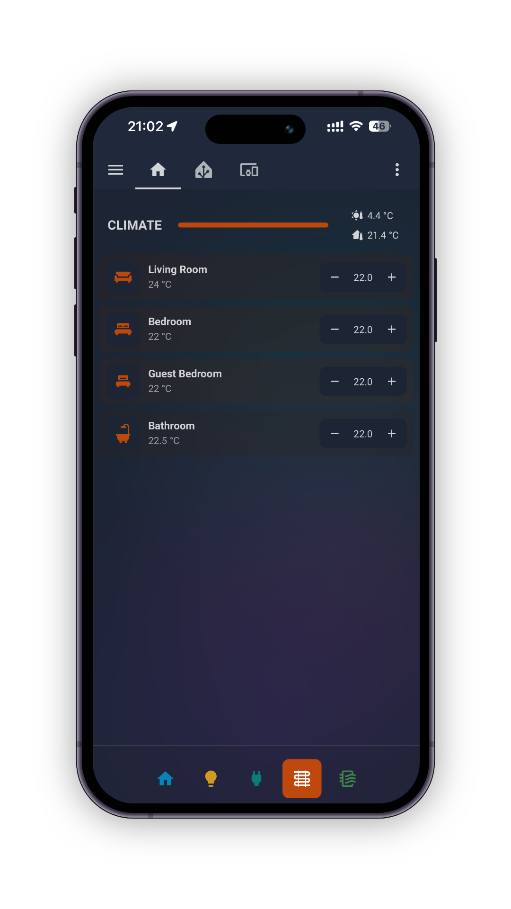

# Bubble Mobile Sections

[](https://github.com/hacs/integration)

Bottom navigation for Home Assistant Lovelace sections dashboards on mobile. It builds the buttons automatically from your Bubble Card separators.

|  |  |
| :---------------------------------: | :-------------------------------: |

## Requirements

- Home Assistant with Lovelace sections view
- [Bubble Card](https://github.com/Clooos/Bubble-Card) separators in your dashboard

## Installation

### HACS

1. Open HACS
2. Go to **Frontend**
3. Click the three dots menu → **Custom repositories**
4. Add `https://github.com/pierrecholhot/bubble-mobile-sections` as a **Dashboard** resource
5. Search for **Bubble Mobile Sections** and install it
6. Restart Home Assistant

### Manual

1. Download `bubble-mobile-sections.js` from the [latest release](https://github.com/pierrecholhot/bubble-mobile-sections/releases/latest)
2. Place it in `config/www/`
3. Add the resource in **Settings → Dashboards → Resources**:
   - URL: `/local/bubble-mobile-sections.js`
   - Type: javascript module
4. Restart Home Assistant

### Setup

Add Bubble Card separator cards to your dashboard. Each separator becomes a navigation button. The separator's icon and color are used for the button, the name for routing.

The navigation bar appears automatically on mobile devices on enabled dashboard paths.

## Customization

### CSS

Use `#bms-nav` to target the nav and its children. The following CSS variables are available:

| Variable                      | Default                    | Description                      |
| ----------------------------- | -------------------------- | -------------------------------- |
| `bms-nav-background`          | `rgba(28, 28, 28, 0.1)`    | Background color                 |
| `bms-nav-border-color`        | `rgba(255, 255, 255, 0.1)` | Top border color                 |
| `bms-nav-gap`                 | `8px`                      | Gap between buttons              |
| `bms-nav-z-index`             | `9`                        | Stack order                      |
| `bms-nav-blur`                | `10px`                     | Backdrop blur amount             |
| `bms-btn-height`              | `48px`                     | Button height                    |
| `bms-btn-min-width`           | `48px`                     | Button minimum width             |
| `bms-btn-padding`             | `0 8px`                    | Button padding                   |
| `bms-btn-color`               | `transparent`              | Button background color fallback |
| `bms-btn-text-color`          | `white`                    | Button text/icon color           |
| `bms-btn-border-radius`       | `8px`                      | Button border radius             |
| `bms-btn-transition-duration` | `0.15s`                    | Animation duration               |
| `bms-btn-active-scale`        | `0.95`                     | Scale when pressed               |
| `bms-btn-active-opacity`      | `0.8`                      | Opacity when pressed             |
| `bms-btn-icon-size`           | `24px`                     | Icon size                        |

These variables can be set in a YAML theme or via a CSS override file.

To use an override file, create `config/www/bms-overrides.css` and add it as a resource in **Settings → Dashboards → Resources** or in your dashboard YAML:

```yaml
resources:
  - url: /local/bms-overrides.css
    type: css
```

Example `bms-overrides.css`:

```css
#bms-nav {
  --bms-btn-text-color: pink;
  box-shadow: 0 0 10px #000;
}

#bms-nav .bms-btn {
  border: 1px solid #fff;
}
```

Button labels are rendered (as `.bms-btn-label`) but hidden by default. To show icon + text buttons:

```css
#bms-nav .bms-btn {
  gap: 6px;
}
#bms-nav .bms-btn-label {
  display: inline;
  font-size: 12px;
  white-space: nowrap;
}
```

### JavaScript

To override default config values, create `config/www/bms-config.js` and add it as a resource in **Settings → Dashboards → Resources** or in your dashboard YAML:

```yaml
resources:
  - url: /local/bms-config.js
    type: module
```

Example `bms-config.js`:

```javascript
window.BubbleMobileSections = {
  config: {
    // Max screen width in pixels for mobile mode
    mobileBreakpoint: 767,
    // Enable to add a bottom padding to the navigation that is equal to the device safe area
    safeAreaPadding: false,
    // URL glob patterns where navigation is active (use `*` for segment and `**` for any path)
    enabledPatterns: ['/lovelace/*'],
    // Shadow DOM element paths to find the sections view
    sectionViewPaths: [
      // main view
      ['home-assistant', 'home-assistant-main', 'ha-panel-lovelace', 'hui-root', 'hui-sections-view'],
      // tabs inside main view
      ['home-assistant', 'home-assistant-main', 'partial-panel-resolver', 'ha-panel-lovelace', 'hui-root', 'hui-sections-view'],
    ],
    // Fallback icon when separator has no icon
    defaultIcon: 'mdi:view-dashboard',
    // ID for the injected style element
    styleId: 'bms',
    // Interval in ms between DOM detection attempts
    pollInterval: 200,
    // Max detection attempts before giving up
    pollMaxAttempts: 50,
    // Delay in ms before rechecking after device wake
    wakeDebounceDelay: 300,
    // Delay in ms for secondary wake recheck
    wakeRecheckDelay: 500,
    // Delay in ms after URL navigation changes
    navigationDelay: 100,
    // Throttle delay in ms for resize events
    resizeThrottleDelay: 150,
  },
}
```

## Advanced

### Shadow DOM & View Detection

This plugin runs inside Home Assistant's Shadow DOM. To locate the active Sections view reliably, it follows a configured list of element paths (`sectionViewPaths`). The default paths work out of the box for Lovelace Sections views, but can be adapted to work with any Shadow DOM tree.

### Timing & Polling Tuning

All detection/refresh intervals are exposed because the best values depend on your dashboard complexity and device performance. If you notice a brief flash of content, or the navigation appears a bit late/early after navigation or wake, tweak `pollInterval`, `pollMaxAttempts`, and the wake/navigation delays to match your setup.

## Known Limitations

This plugin is currently not compatible with [Bubble Card Popups](https://github.com/Clooos/Bubble-Card?tab=readme-ov-file#pop-up)

## Troubleshooting

When testing several configurations on mobile devices, clear the frontend cache in **Settings → Companion app → Debugging → Reset frontend cache**.

## License

MIT
